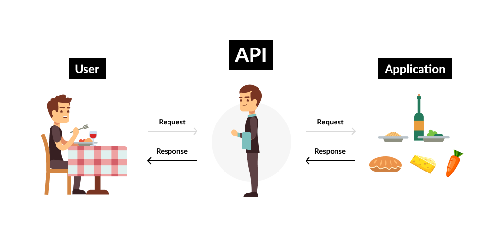
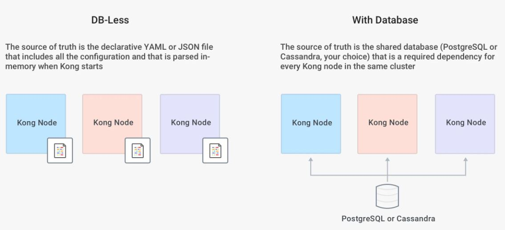

# API Gateway

### APIs
É um conjunto de operações bem definidas com objetivo de oferecer aos seus consumidores um serviço, produto ou uma integração.

Na prática o consumidor de uma API utiliza o serviço sem a necessidade de entender os detalhes de implementação, essa é uma característica que deve ser preservada.

APIs conhecidas
- Twiter
- GCP
- AWS
- Salesforce
- Stripe

### API Gateway

#### API Gateway Pattern
Em um modelo que implementa um padrão de arquitetura de microsserviços, como os clientes vão poder identificar o serviço que contém as informações que ele necessita?

Em geral a granularidade das informações do microsserviço é diferente da qual gostaríamos de expor para o cliente.

**API Gateway** é uma ferramenta de gerenciamento, geralmente adicionada entre o cliente e um grupo de sistemas de um determinado contexto, atuando como ponto único de entrada das APIs.

#### Funcionalidades de um API Gateway
Geralmente o API Gateway atua na camada de rede, provendo funcionalidades ortogonais, que necessariamente não são responsabilidade das aplicações.

- Controle de abuso (rate limiting)
- Autenticação / Autorização de maneira padronizada
- Controle de Logs
- Gerenciamento de APIs (touting)
- Metricas padronizadas (ops team)
- Tracing Distribuido

#### Tipos de API Gateway

**Enterprise Gateway**
- Foco deste tipo de solução é na grande maioria das vezes realizar exposição e gerenciamento de deployment de APIs voltadas ao negócio, em geral ele também permite controlar o ciclo de vida de uma API.
- Em geral é uma oferta de algum vendor, com estratégias comerciais suportando a solução. Este também tende a direcionar a aplicação da solução e implicar no segign dos seus serviços.
- Propósito principal: Exposição, composição e gerenciamento de APIs externas/internas
- Manutenção das APIs: Time de APis em geral faz administração via Portal do API Gateway
- Suporta múltiplos ambientes DEV, QA e Prod
- Pode ser utilizado para um modernização de arquitetura aplicando padrões como Façade ou Starngler Application (deve ser o meio, e não o final da solução)
- Disponibilidade vs COnsistência (dependências externas)
- Cuidado com utilização de "policies" da própria ferramenta (vendor lock-in)
- Em geral precisam de dependencias externas, como banco de dados, caches entro outros, **CUIDADO** isso pode aumentar suas chances de ter indisponibilidade
- A "mobilidade" de deployment é bem baixa, enterprise gateways são **EDGE** na maioria dos casos
- Vendor Lock-in

**Micro/Microservices Gateway**
- Tipicamente essa classe de Gateways tem a capacidade de "rotear" tráfego de entrada para APIs ou serviços. Em geral não oferecem suporte ao ciclo de vida das APIs e as equipes tem que fazêlo via processo separado
- Maioria open source
- Geralmente não possuem dependencias externa, e são componentes standalone, o que faz com que a plataforma (k8s) gerencie o estado necessário para a execução da aplicação
- Propósito principal: Exposição, observabilidade e monitoramento de serviços (APIs)
- Manutenção da APIs: Time de API ou time de criação/manutenção do serviço via configuração declarativa fazem atualizações, esta tarefa faz parte do deployment dos serviços
- Suporte a ambientes: A instância controla um único ambiente, possui suporte a roteamento mais dinâmico como por exemplo Canary para facilitar o debugging.
- Reduza o número de instancias para ganhar experiencia na gestão do ambiente para escalar para toda companhia.
- Use a flexibilidade do deploymento para "particionar" suas APIs (use Bounded Context do DDD)
- Tente ser **Stateless** o máximo possível isso vai aumentar muito a facilidade de escalabilidade/disponibilidade
- Número de instancias pode ser um problema em equipes sem expertise em monitoramento/observabilidade
- Granulidade fina demais, pode complicar a manutenção
- Automação deve ser pensada desde o início da jornada

#### Papel da API Gateway na Arquitetura de Microserviços

**Hyperconnectivity mess**

- Camada entre o externo e as aplicações / PEP - Policy Enforcement Point
- Camada entre Microsserviços

#### Vantagens e Desvantagens de um API Gateway

Vantagens:
- Padronização de algumas features ortogonais (logging, segunrança)
- Ajuda na governança de rede da campanhia
- Ponto único de entrada na rede, facilita gerenciamento
- Ferramenta essencial para adoção de uma estratégia de APIs

Desvantagens:
- Adiciona alguma complexidade na sua arquitetura
- Precisa de um cuidado extra, devido a disponibilidade
- Ferramenta que precisa de manuenção/atualização

#### Como escolher um API Gateway
- Considere o desenho das equipes da sua companhia na escolha.
- Esquipes Especialistas: API Gateway Enterpriser
- Equipes Multidisciplinares: Micro API Gateway 
- Defina um plano para suas APIs, e inclua a escolha do API Gateway de acordo com a estrategia

# Kong API Gateway
- API Gateway Open Source
- Caracteristicas Micro Gateway
- Deploy Flexivel
- Pronto para Kubernetes
- Extensivel via plugins

#### Arquitetura
- Administration APIs
- Plugins
- Clustering & Datastore
- Open Resty
- nginx

Downstream ---->||----> Proxy ---->||----> Upstream

#### Subscription
- Plugins Pagos / Free

#### Modelos de deployment
- DB-Less
- With Database

- Deployment Distribuido
- Deplyment Hibrido

#### Konga
- Interface administrativa para o Kong API Gateway
- Visualização de métricas das instâncias
- Controle de usuários
https://github.com/pantsel/konga

#### Serviços
Um serviço é uma entidade que representa uma API ou microserviço
upstream - por exemplo, um microsserviço de transformação de dados ou uma API de cobrança

#### Rotas
"Caminho" de url que permite que um serviço seja acessado pelo Kong API Gateway

#### Plugins
Um pedaço de código que pode ser executado dentro de um ciclo de vida de uma requisição HTTP, tanto na fase de request como no response.

Podem ser configurados nas Rotas, Serviços, Consumers e Globalmente, atente-se a precedencia das configurações.

Você pode criar seu plugin utilizando a linguagem Lua, Javascript e Golang

Kong API Gateway possui alguns plugins da comunidade que podemser instalados na versão community

#### Correlation ID (Plugin)
https://docs.konghq.com/hub/kong-inc/correlation-id/

#### Response transformer (Plugin)
https://docs.konghq.com/hub/kong-inc/response-transformer/

#### Consumers
Representa um consumidor que pode ser usuário ou um serviço, esse pode ser utilizado para aplicação de plugins de segurança.

#### Basic Authentication
https://docs.konghq.com/hub/kong-inc/basic-auth/

#### Key Authentication
https://docs.konghq.com/hub/kong-inc/key-auth/

#### Modelo de deployment

Como escolher o modelo de deployment do Kong API Gateway

- Kong API Gateway na Borda (Edge); Protegendo serviços do mundo externo.
- Kong API Gateway por Contexto; Entre Serviços. Estabelendo um controler de abuso de utilização

- DB-Less
- With Database